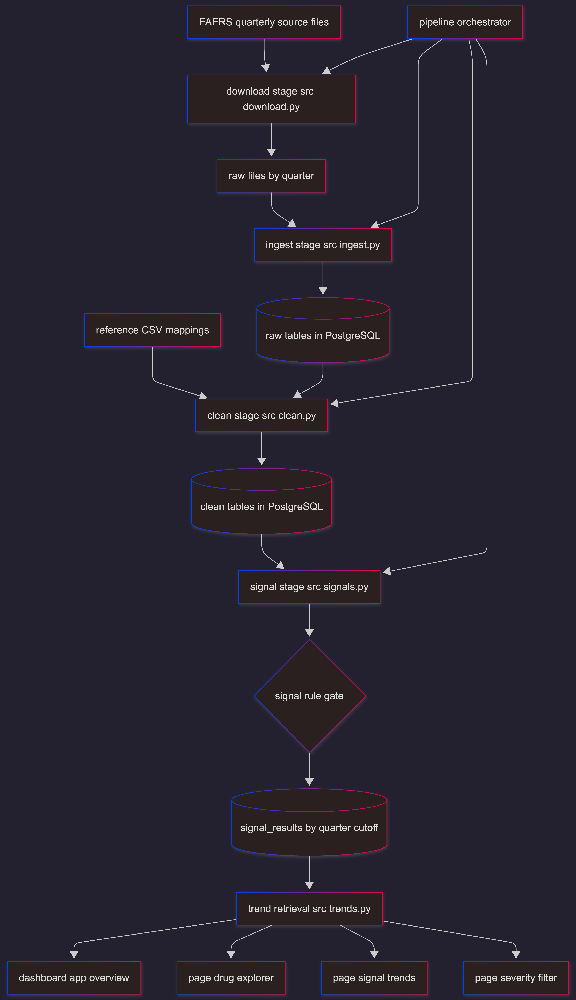
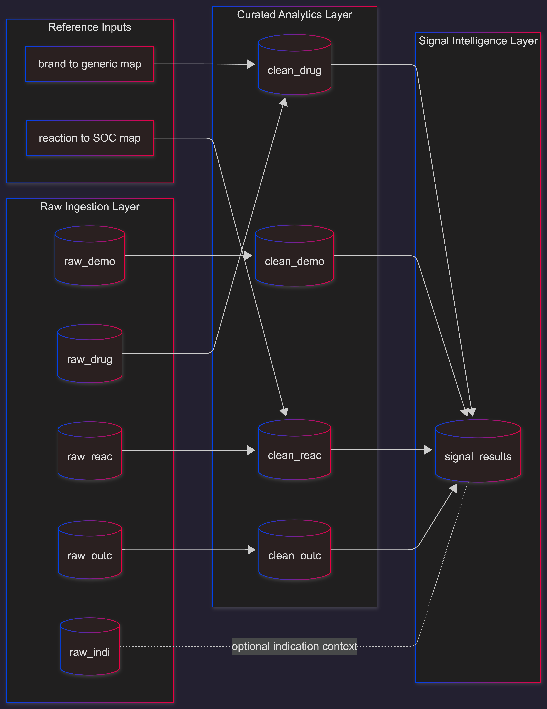

# FAERS Signal Detector

## Project Idea
FAERS Signal Detector is a pharmacovigilance analytics system that converts raw FDA Adverse Event Reporting System (FAERS) case files into interpretable drug-safety signals. The project is designed to help analysts move from fragmented spontaneous-report data to structured evidence on potential drug-event risk relationships.

At its core, the platform identifies disproportional reporting patterns using established signal-detection statistics and presents those patterns in an investigation-oriented dashboard.

## Inspiration
Spontaneous adverse-event reporting data is high-volume, heterogeneous, and operationally difficult to analyze in a consistent way. Safety review teams often need to answer questions such as:

- Which drug-event pairs are emerging as potential signals?
- Are signals strengthening or weakening over time?
- Which signals are associated with severe outcomes and should be prioritized?

This project was built to create a reproducible, transparent workflow from raw FAERS quarterly files to clinically meaningful signal intelligence.

## Problem Statement
The exact problem addressed by this project is the gap between raw pharmacovigilance data availability and actionable signal interpretation.

FAERS data alone does not directly provide:

- Standardized drug naming across brands, formulations, and reporting variations
- Deduplicated case-level views suitable for reliable counts
- Consistent event taxonomy mapping for organ-system-level analysis
- Time-aware, cumulative signal metrics that support trend interpretation
- Prioritization views focused on high-severity outcomes

Without this transformation layer, safety analysts face noisy, inconsistent inputs and spend substantial effort on preprocessing before signal review can begin.

## How the Project Solves the Problem
FAERS Signal Detector solves this by implementing an end-to-end analytical pipeline and a targeted exploration interface:

1. Ingests multi-quarter FAERS source files into a relational model.
2. Normalizes and deduplicates core entities (demographics, drugs, reactions, outcomes).
3. Standardizes drug names to improve cross-report aggregation.
4. Enriches reactions with SOC mappings for clinical grouping.
5. Computes disproportionality metrics (PRR, Chi-square, ROR with confidence bounds).
6. Applies strict, published thresholds to separate background noise from candidate signals.
7. Computes cumulative quarter-by-quarter results to enable temporal signal evolution analysis.
8. Surfaces findings through focused dashboard workflows (drug-first lookup, trend exploration, severity triage).

## System Overview
The platform has three tightly connected layers:

- Data acquisition and ingestion layer for FAERS quarterly ASCII datasets
- Data curation and signal analytics layer in PostgreSQL-backed Python processing modules
- Visualization layer in Streamlit with Plotly for interactive pharmacovigilance review

This separation ensures that statistical computation is reproducible and independent of presentation, while still enabling rapid analyst interaction.

## Detailed Methodology

### 1. Data Acquisition
- Quarterly FAERS ASCII archives are fetched from FDA export endpoints.
- Each archive is extracted and organized by quarter label (for example, `2024Q1`).
- The process supports cumulative quarter ranges configured in project settings.

### 2. Raw Ingestion
- Five FAERS domains are loaded into raw tables: demographics (`DEMO`), drugs (`DRUG`), reactions (`REAC`), outcomes (`OUTC`), indications (`INDI`).
- The ingestion logic handles historical delimiter variability and inconsistent source casing.
- Numeric columns are type-sanitized and oversized text is trimmed against schema limits to prevent load failures.

### 3. Data Cleaning and Standardization

#### 3.1 Report deduplication
- Cases are deduplicated using `caseid` and recency ordering, preserving the most recent report version.

#### 3.2 Demographic normalization
- Age values are converted to years using FAERS age units.
- Out-of-range values are discarded to reduce implausible demographics.

#### 3.3 Drug normalization
- Drug names are cleaned by removing dosage/formulation artifacts.
- Brand names are mapped to generic names using reference mappings.
- Fuzzy matching is applied when direct mappings are unavailable, improving canonicalization coverage.

#### 3.4 Reaction enrichment
- Preferred terms are standardized and mapped to System Organ Class (SOC) categories.
- Reaction records are deduplicated at the report-term level.

#### 3.5 Outcome alignment
- Outcomes are filtered and aligned with cleaned report records to preserve consistency across downstream joins.

### 4. Signal Detection
For each drug-event pair, a $2\times2$ contingency structure is constructed:

- $a$: reports containing both the drug and event
- $b$: reports containing the drug without the event
- $c$: reports containing the event without the drug
- $d$: reports containing neither

From this, the following are computed:

- PRR (Proportional Reporting Ratio)
- Chi-square statistic (Yates-corrected variant)
- ROR (Reporting Odds Ratio)
- 95% confidence interval bounds for ROR

Signal confirmation uses Evans-style criteria:

| Criterion | Threshold |
|---|---|
| Case count | $\geq 3$ |
| PRR | $\geq 2.0$ |
| Chi-square | $\geq 4.0$ |
| ROR lower 95% CI | $> 1.0$ |

Only pairs satisfying all criteria are flagged as confirmed signals.

### 5. Temporal Signal Modeling
- Signals are computed cumulatively for each quarter cutoff.
- This enables trend analysis of signal strength and confidence over time rather than static snapshot inspection.

### 6. Analyst-Facing Interpretation Layer
The dashboard is organized around practical pharmacovigilance workflows:

- Drug-centric exploration of strongest adverse-event associations
- Quarter-wise trend tracing for specific drug-event hypotheses
- Severity/outcome-oriented filtering for triage and prioritization

## Architecture

### Processing Architecture
The backend follows a modular, stage-based pipeline:

- `src/download.py`: quarter enumeration, archive retrieval, extraction
- `src/ingest.py`: raw file discovery, parsing, schema-aware loading
- `src/clean.py`: deduplication, normalization, enrichment, clean-table assembly
- `src/signals.py`: contingency construction and disproportionality computation
- `src/trends.py`: trend-oriented signal retrieval and ranked views
- `pipeline.py`: orchestration of database setup and stage execution

### Data Architecture
Relational design separates raw and curated concerns:

- Raw tables: `raw_demo`, `raw_drug`, `raw_reac`, `raw_outc`, `raw_indi`
- Clean tables: `clean_demo`, `clean_drug`, `clean_reac`, `clean_outc`
- Analytical table: `signal_results`

This structure preserves source fidelity while providing optimized, analysis-ready entities.

### Presentation Architecture
The dashboard layer (`dashboard/`) provides:

- Main overview and KPI surfaces
- Focused pages for drug exploration, trend analysis, and severity filtering
- Shared UI and component modules for consistent rendering and interaction patterns

## Complete Project Flow Diagram

## Data Lineage Diagram

## Tech Stack

### Core Language
- Python

### Data and Statistics
- pandas
- numpy
- scipy

### Database and Access
- PostgreSQL
- SQLAlchemy
- psycopg2

### Data Quality and Normalization
- rapidfuzz
- regex

### Data Acquisition
- requests
- tqdm
- kaggle (reference dataset utility)

### Visualization and Interface
- Streamlit
- Plotly

### Quality and Development
- pytest
- python-dotenv
- Jupyter ecosystem tooling

## What This Project Delivers
FAERS Signal Detector delivers a reproducible pharmacovigilance intelligence workflow that:

- Transforms raw regulatory safety reports into standardized analytical datasets
- Detects candidate safety signals using established disproportionality methods
- Tracks signal dynamics over time using cumulative quarter modeling
- Supports severity-driven prioritization for focused safety review
- Provides interpretable, investigation-ready views for analysts and domain stakeholders

## Data Source Context
The project uses publicly available FDA FAERS quarterly data. These reports are spontaneous submissions and should be interpreted as signal-generation evidence rather than direct causal proof. The system is therefore positioned for detection and prioritization, not standalone clinical adjudication.
